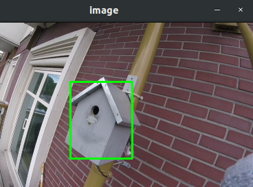
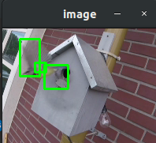

# motion_detection_AOI_video

Detects motion of an video file/stream based on area of interest.

Based on https://www.pyimagesearch.com/2015/05/25/basic-motion-detection-and-tracking-with-python-and-opencv/

I often leave my GoPro statically placed in rolling video recording mode. I don't know where in the video action may take place, therefore i wrote this script. I use it to analyse the .LRV (low resolution video) files the GoPro can generate alongside the high res video.

Tested with Python 2.7 and opencv 3.2.0

## How to use:

`python motion_detection.py [-v resource/GOPR_example.LRV]`

An image will pop up in which an area of interest rectangle can be drawn, press enter afterwards.

The script will output the selected area of interest frames when motion is detected, and print the time. 

`Motion detected at  1:50 (frame 1108)`

